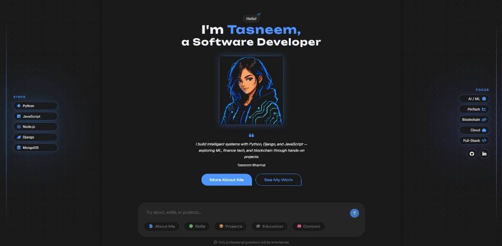

# Tasneem Bharmal — Portfolio

Interactive PHP portfolio with a chat-style UI. Explore skills, projects, education, and contact — all through a conversational interface.

## Features

- **Chat-based navigation** — ask about skills, projects, education, CV, and more
- **Project showcase** — Niftendo (NFT marketplace) and Investify (stock market learning app)
- **CV download** — saves as `Tasneem Bharmal - CV.pdf`
- **Contact form** — messages logged via `contact.php`
- **Dark theme** — multicolor accent skin with side stack/focus panels
- **Responsive layout** — works on desktop and mobile

## Tech stack

| Layer | Technologies |
|-------|--------------|
| Backend | PHP |
| Frontend | HTML, CSS, JavaScript |
| Icons | Font Awesome |
| Fonts | Geist, Unbounded (Google Fonts) |
| Server | Apache (XAMPP) |

## Contact

- **Email:** tasneembharmal712@gmail.com
- **GitHub:** [@T-B404](https://github.com/T-B404)
- **LinkedIn:** [tasneem-b-400880292](https://linkedin.com/in/tasneem-b-400880292)

## License

Personal portfolio project — feel free to use as reference; please don’t copy verbatim for your own portfolio.
